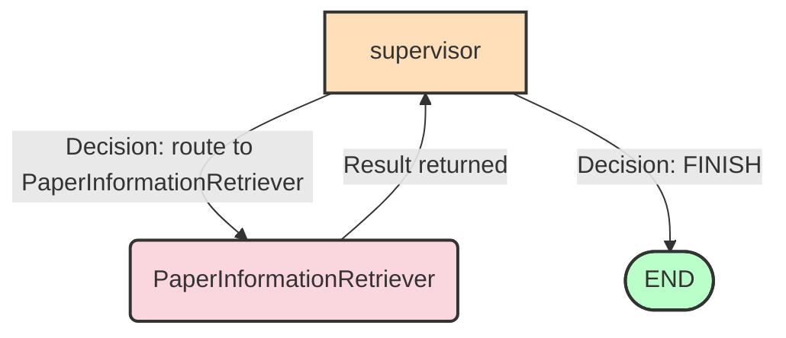

#### Diagram for Activity #2 Flow

This diagram shows the specific path taken in the execution stream printed above:

```mermaid
graph TD
    A[supervisor] -->|Decision: route to PaperInformationRetriever| B(PaperInformationRetriever);
    B -->|Result returned| A[supervisor];
    A -->|Decision: FINISH| C([END]);

    style A fill:#ffdfba,stroke:#333,stroke-width:2px
    style B fill:#fad7de,stroke:#333,stroke-width:2px
    style C fill:#baffc9,stroke:#333,stroke-width:2px
```

